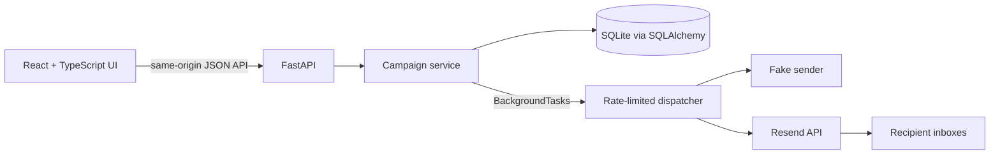

# Catlister Campaign Dispatcher

A focused full-stack campaign manager for creating campaigns, managing contacts and reusable templates, sending personalized email, and reviewing delivery history. The React UI, FastAPI API, SQLite database, and Resend integration ship as one Docker image.

## Live demo

The application is deployed at [catlister-campaign-demo.up.railway.app](https://catlister-campaign-demo.up.railway.app/).

The demo is protected by a shared reviewer password. Credentials are distributed separately and are intentionally not committed to the repository.

## Product capabilities

- Create, view, edit, and delete campaigns.
- Add, edit, opt out, and delete contacts, with a deliberate limit of 10 per campaign.
- Import contacts atomically from a UTF-8 CSV file with `first_name,email` headers.
- Create, edit, reuse, and delete message templates.
- Personalize subjects and messages with `{first_name}` and see a live preview.
- Send asynchronously through Resend at a configurable rate (one email per second by default).
- Safely simulate delivery with the fake provider during development and tests.
- Preserve immutable send snapshots and per-recipient outcomes for every run.
- Show the newest delivery summary first and expand any run for recipient-level details.
- Protect a public demo with an optional shared password.

## Architecture



The frontend and API are served from one origin in production. Controllers handle HTTP concerns, Pydantic models define API contracts, and the service layer owns transactions, orchestration, and send-state transitions. The schema and starter data live in `database/schema.sql`.

### Send lifecycle

1. The API validates that the campaign has contacts and a selected template.
2. It snapshots the template and every recipient into a new run, then returns `202 Accepted`.
3. A FastAPI background task claims eligible outcomes sequentially and applies the configured rate.
4. Opted-out contacts are skipped immediately; provider results are recorded per recipient.
5. The run finishes as completed, completed with errors, failed, or interrupted.

Resend acceptance means the provider accepted the request; it does not guarantee inbox placement. Interrupted or ambiguous submissions are never retried automatically, which avoids accidental duplicate email.

## Technology

- React 19, TypeScript, Vite, and TanStack Query
- FastAPI, Pydantic, SQLAlchemy, and HTTPX
- SQLite with explicit foreign keys and transactional writes
- Resend HTTP API
- Pytest, Ruff, Vitest, and TypeScript checks
- Multi-stage Docker build and Railway hosting

## Run locally

Prerequisites: Python 3.12, [uv](https://docs.astral.sh/uv/), Node.js 22, and npm.

```bash
cp .env.example .env
make setup
make db-reset
make dev
```

Open [localhost:5173](http://localhost:5173/). FastAPI documentation is available at [localhost:8000/docs](http://localhost:8000/docs).

`make db-reset` replaces the local development database with the starter schema. Do not use it against a database containing data you want to keep.

## Email configuration

### Safe local mode

No real message leaves the application:

```env
EMAIL_PROVIDER=fake
SEND_RATE_PER_SECOND=1
```

### Resend with a verified domain

The deployed demo uses the verified `mail.ranjan.ai` domain:

```env
EMAIL_PROVIDER=resend
RESEND_API_KEY=re_your_server_side_key
RESEND_FROM_EMAIL=Catlister <campaigns@mail.ranjan.ai>
SEND_RATE_PER_SECOND=1
```

Do not set `RESEND_DEMO_RECIPIENT` when using a verified domain. The API key remains server-side and is excluded from Git and the Docker build context.

### Resend shared test sender

For a no-domain test, use `onboarding@resend.dev` and restrict delivery to the email associated with the Resend account:

```env
EMAIL_PROVIDER=resend
RESEND_API_KEY=re_your_server_side_key
RESEND_FROM_EMAIL=Campaign Dispatcher <onboarding@resend.dev>
RESEND_DEMO_RECIPIENT=your-resend-account-email@example.com
SEND_RATE_PER_SECOND=1
```

The shared sender cannot deliver to arbitrary recipients. A verified domain is required for that.

## CSV format

```csv
first_name,email
Maya,maya@example.com
Noah,noah@example.com
```

Imports are limited to 64 KiB and 10 rows. A malformed row, duplicate email, invalid address, or resulting campaign size above 10 rejects the entire import, leaving existing contacts unchanged.

## API

| Area | Endpoints |
| --- | --- |
| Authentication | `GET`, `POST`, `DELETE /v1/auth/session` |
| Campaigns | `GET`, `POST /v1/campaigns`; `GET`, `PATCH`, `DELETE /v1/campaigns/{campaign_id}` |
| Contacts | `GET`, `POST /v1/campaigns/{campaign_id}/contacts`; `PATCH`, `DELETE /v1/campaigns/{campaign_id}/contacts/{contact_id}` |
| CSV import | `POST /v1/campaigns/{campaign_id}/contacts/import` |
| Preview | `POST /v1/campaigns/{campaign_id}/preview` |
| Send and history | `POST /v1/campaigns/{campaign_id}/send`; `GET /v1/campaigns/{campaign_id}/runs`; `GET /v1/campaigns/{campaign_id}/runs/{run_id}` |
| Templates | `GET`, `POST /v1/templates`; `GET`, `PATCH`, `DELETE /v1/templates/{template_id}` |

All errors use a consistent JSON envelope containing a machine-readable code, a user-facing message, and optional validation details.

## Verification

```bash
make test
make check
```

The suite covers campaign, contact, and template CRUD; CSV atomicity; personalization; opt-out handling; persisted delivery outcomes; provider safeguards; authentication; frontend API error handling; TypeScript; and the production build.

## Docker

The Makefile provides the complete local Docker workflow. Start the application in the background with:

```bash
cp .env.example .env
make docker-up
```

Open [localhost:8080](http://localhost:8080/), then use:

```bash
make docker-logs  # Follow application logs
make docker-down  # Stop and remove the container
```

For a foreground process, run `make docker-run` instead. It builds the image first and removes the container automatically when stopped. `make docker-build` only builds the production image.

The named `catlister-campaign-data` volume keeps SQLite data between container replacements. The defaults can be overridden when necessary:

```bash
make docker-up DOCKER_PORT=8090 DOCKER_CONTAINER=catlister-review
```

The copied `.env.example` uses the fake provider, so this workflow does not send real email unless the reviewer explicitly configures Resend.

## Railway deployment

Railway builds the root `Dockerfile` and supplies its assigned `PORT` automatically.

1. Connect the GitHub repository to a Railway service.
2. Add a persistent volume mounted at `/data`.
3. Configure these service variables:

   ```env
   DATABASE_PATH=/data/app.db
   EMAIL_PROVIDER=resend
   RESEND_API_KEY=re_your_server_side_key
   RESEND_FROM_EMAIL=Catlister <campaigns@mail.ranjan.ai>
   SEND_RATE_PER_SECOND=1
   APP_PASSWORD=provide-out-of-band
   SESSION_SECRET=generate-a-long-random-value
   ```

4. Leave `RESEND_DEMO_RECIPIENT` unset for the verified domain.
5. Deploy one replica and generate a public domain under the service networking settings.

SQLite and in-process background work intentionally assume a single application replica. A production evolution would use a managed relational database, durable job queue, provider webhooks, user accounts, bounce/suppression management, and observability.

## Repository layout

```text
backend/app/              FastAPI application and domain services
backend/tests/            API and provider tests
database/schema.sql       Schema and deterministic starter data
frontend/src/             React UI, data hooks, and API client
Dockerfile                Production multi-stage image
Makefile                  Local setup, test, and verification commands
```

## Deliberate scope

This is a reviewable demonstration rather than a bulk-email platform. The 10-contact cap, one-replica deployment, simple `{first_name}` replacement, shared demo authentication, and in-process dispatcher keep the implementation proportionate while preserving clear upgrade paths.
